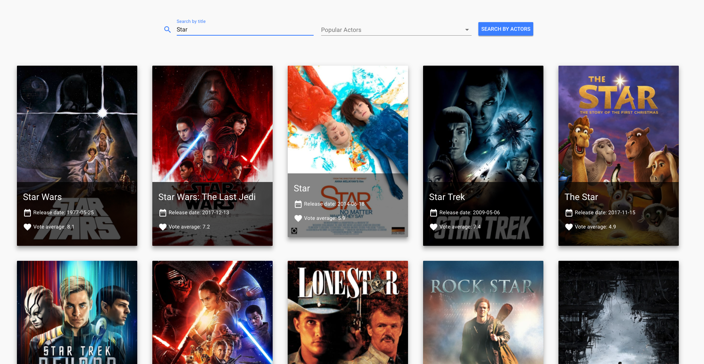

# Nodes Aarhus Innovation Hackathon (8th of March 2018)
## Yoyo cinema x Vue.js

### Versions
* **v1-list-of-movie.html**
First version shows a list of movies using the MovieDb’s *discover/movie* endpoint.

* **v2-search-functionality.html**
Implemeted a search functionality using the API’s *search/movie* endpoint.

* **v3-styling.html**
To make the website look nicer I used Vue Material Components. This allowed me to use material components fast and easy.

* **v4-search-by-actors.html**
Added a dropdown with popular actors from where you can select 1, 2 or more actors to see in what movies they appeared in.

### Usefull links
* https://vuejs.org/v2/guide/
* https://vuematerial.io/
